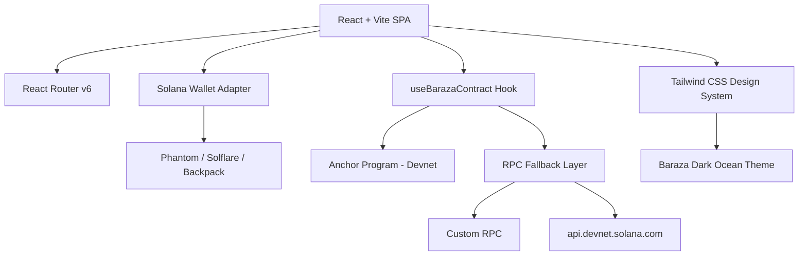

# Baraza Protocol

> **The Digital Village Council** — African community governance on Solana.

Named after the traditional African community council, Baraza gives communities in Nairobi, Lagos, Accra, Kampala, and Kigali the tools to own what they build together — transparently, on-chain.

---

## Overview

Baraza is a decentralized community governance platform built on Solana. It enables any community group (chamas, cooperatives, saccos, professional networks) to:

- **Pool funds** collectively and transparently
- **Propose and vote** on how funds are spent
- **Issue membership cards** as proof of community belonging
- **Track every decision** with immutable on-chain records

---

## Features

- 🏘️ **Community creation** — Create named groups with membership fees and governance rules
- 🗳️ **Decentralized voting** — On-chain proposals with real-time vote tallies and optimistic UI
- 💳 **Membership NFT cards** — Digital membership cards with verifiable on-chain status
- 🏦 **Treasury management** — Transparent fund tracking with Solana wallet integration
- 🌍 **African-first design** — African-futurist aesthetic with KSh-denominated UX
- 🔐 **Multi-wallet support** — Phantom, Solflare, Backpack, Brave, Coinbase
- 📱 **Mobile-first** — Fully responsive with mobile wallet compatibility
- ⚡ **RPC fallback** — Automatic failover across multiple Solana RPC endpoints

---

## Architecture



---

## Tech Stack

| Layer | Technology |
|-------|-----------|
| Frontend | React 18 + TypeScript + Vite |
| Styling | Tailwind CSS + Custom Design Tokens |
| Animation | Framer Motion |
| Routing | React Router v6 (SPA) |
| Blockchain | Solana (Devnet) |
| Wallet | @solana/wallet-adapter |
| UI Primitives | Radix UI |
| Deployment | Vercel |

---

## Installation

```bash
# Clone
git clone https://github.com/your-org/baraza-protocol.git
cd baraza-protocol/Project\ Title

# Install
npm install --legacy-peer-deps

# Start dev server
npm run dev
```

---

## Environment Setup

Copy `.env.example` to `.env.local`:

```bash
cp .env.example .env.local
```

| Variable | Required | Description |
|----------|----------|-------------|
| `VITE_RPC_ENDPOINT` | No | Custom Solana RPC URL (falls back to public devnet) |
| `VITE_PROGRAM_ID` | No | Baraza on-chain program ID |
| `VITE_SUPABASE_URL` | No | Supabase URL for off-chain metadata |
| `VITE_SUPABASE_ANON_KEY` | No | Supabase anon key |

---

## Wallet Setup

The app supports multiple Solana wallets. For development:

1. Install [Phantom](https://phantom.app/) browser extension
2. Switch to **Devnet** in Phantom settings
3. Get devnet SOL from [faucet.solana.com](https://faucet.solana.com/)
4. Connect wallet via the header button

---

## Project Structure

```
src/
├── components/
│   ├── ui/              # Radix UI primitives (Button, Card, Toast…)
│   ├── Header.tsx       # Navigation + WalletStatus
│   ├── Footer.tsx       # Site footer
│   ├── Layout.tsx       # Page wrapper
│   ├── WalletStatus.tsx # Custom wallet dropdown with chain check
│   ├── DecisionCard.tsx # Voting card with optimistic updates
│   ├── CommunityCard.tsx
│   ├── MembershipCard.tsx
│   ├── HeroSection.tsx
│   ├── FeaturesSection.tsx
│   ├── CTASection.tsx
│   └── AshaChat.tsx     # AI governance assistant
├── pages/
│   ├── Index.tsx        # Landing page
│   ├── Communities.tsx  # Community discovery
│   ├── CommunityDashboard.tsx
│   ├── CreateCommunity.tsx
│   ├── CreateDecision.tsx
│   └── NotFound.tsx
├── hooks/
│   ├── useBarazaContract.ts  # On-chain read/write separation
│   ├── useWalletGuard.ts     # Wallet connection gate
│   ├── use-toast.ts
│   └── use-mobile.tsx
└── lib/
    ├── constants.ts     # Mock data + community types
    ├── utils.ts         # cn(), formatKSh(), truncateAddress()
    └── rpc.ts           # RPC endpoint management + fallback
```

---

## Deployment

```bash
# Build for production
npm run build

# Deploy to Vercel
vercel --prod
```

See [DEPLOYMENT.md](./docs/DEPLOYMENT.md) for full deployment guide.

---

## Smart Contract Integration

See [CONTRACT_INTEGRATION.md](./docs/CONTRACT_INTEGRATION.md) for Anchor program integration details.

Current status: **Mock data** with Solana transaction scaffolding. Production requires deploying the Anchor program and updating `VITE_PROGRAM_ID`.

---

## Contributing

1. Fork the repo
2. Create a feature branch: `git checkout -b feat/your-feature`
3. Commit with conventional commits: `git commit -m "feat: add treasury view"`
4. Open a PR

---

## License

MIT © Baraza Protocol
