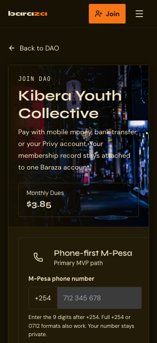
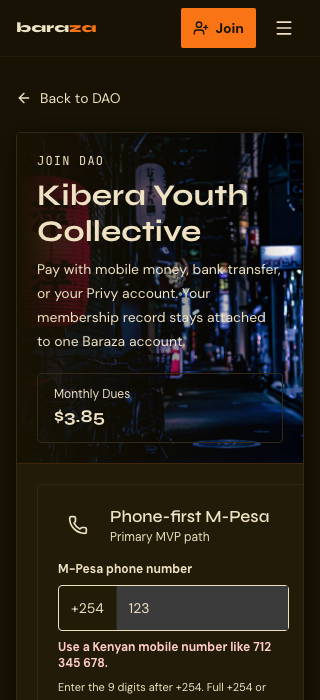
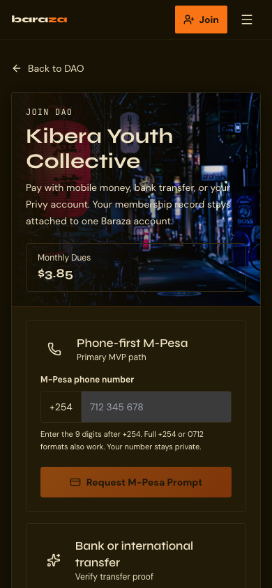
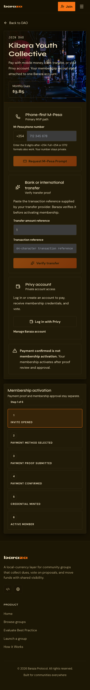

# Mobile Join Flow Accessibility Audit

Issue: https://github.com/Build-Africa-DAO/baraza-protocol/issues/27

Route audited: `/join/1`

Date: 2026-07-07

Tools:
- Playwright Chromium 1.57.0
- axe-core 4.11.0
- Manual keyboard and compact-phone viewport review

Viewports:
- 320 x 700, compact phone
- 390 x 844, mobile phone

## Summary

The mobile join flow passed automated WCAG 2.2 AA axe checks after the fixes in this patch. The main manual issues were compact-phone layout obstruction from the fixed bottom navigation and unclear phone-format instructions around the visual `+254` prefix.

Final verification:
- 320 x 700: 0 axe violations, no horizontal overflow
- 390 x 844: 0 axe violations, no horizontal overflow

See [results.json](./results.json) for the raw verification summary.

## Finding 1: Fixed Bottom Nav Covered Join Form Feedback

WCAG 2.2 AA mapping:
- 1.4.10 Reflow
- 2.4.11 Focus Not Obscured (Minimum)
- 3.3.1 Error Identification

Severity: Medium

### Reproduction

1. Open `/join/1` at 320 x 700.
2. Move to the M-Pesa phone field.
3. Enter an invalid value such as `123`.
4. Observe that the fixed mobile bottom navigation competes with the lower part of the form and can hide feedback or payment controls on a compact phone viewport.

### Fix

`Layout` now treats `/join/*` as a task flow and hides the fixed mobile bottom navigation there. It also removes the extra `pb-24` padding used only to clear that nav on general pages.

Files:
- `app/src/components/Layout.tsx`
- `app/src/components/__tests__/Layout.test.tsx`

## Finding 2: Phone Format Instructions Were Ambiguous

WCAG 2.2 AA mapping:
- 3.3.2 Labels or Instructions
- 3.3.3 Error Suggestion
- 4.1.2 Name, Role, Value

Severity: Medium

### Reproduction

1. Open `/join/1` on a phone viewport.
2. Review the M-Pesa phone field.
3. The UI shows a visible `+254` prefix but the placeholder previously used a national `0712 345 678` example, which could lead users to enter a duplicated prefix or be unsure what format is expected.
4. Enter an invalid value such as `123`; the disabled CTA did not provide an immediate inline error.

### Fix

The M-Pesa phone field now:
- Uses placeholder `712 345 678`, matching the visible `+254` prefix.
- Adds `aria-describedby` instructions.
- Sets `aria-invalid` on invalid input.
- Shows a high-contrast `role="alert"` error before the help text.
- Keeps the CTA disabled until a valid Kenyan mobile number is provided.

Files:
- `app/src/pages/JoinDao.tsx`
- `app/src/pages/__tests__/JoinDao.test.tsx`

## Screenshots

### Compact Phone Top State

### Compact Phone Invalid Phone Feedback

### 390px Phone Top State

### 390px Full Page

## Remaining Recommendation

The Privy-account option can be disabled in local or unconfigured environments. If this flow is shown in that state, add a short inline reason beside the disabled Privy button, for example: `Privy login is unavailable in this environment.` This is an implementation-ready recommendation, not a blocker for the audited mobile join flow in a configured production environment.
