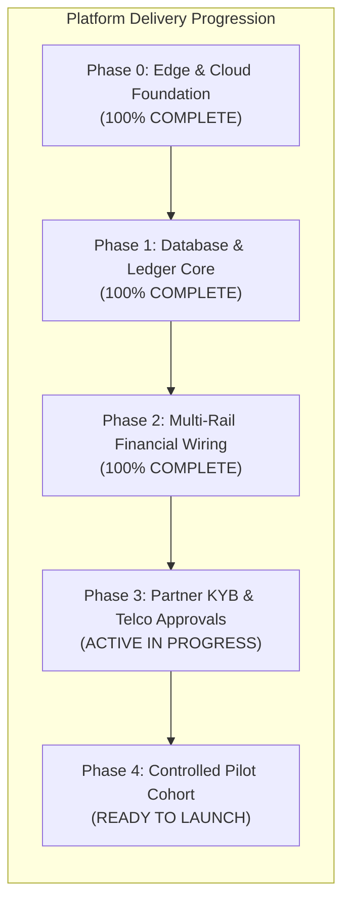
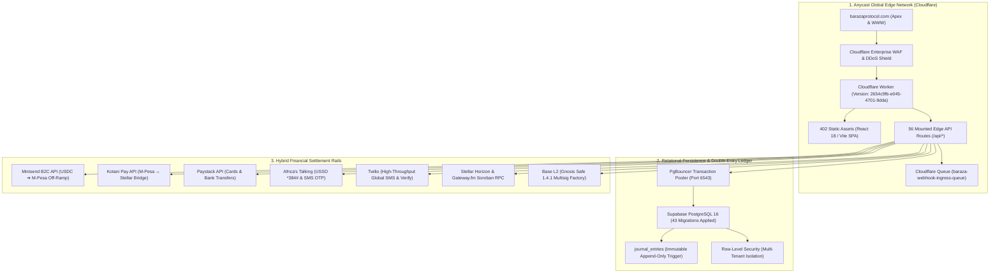

# Executive Board Status Quo Report & Infrastructure Go-Live Audit

**Document Reference:** `BRZ-BOARD-STATUS-2026-Q3`  
**Classification:** Board of Directors & Executive Leadership Briefing  
**Lead Author:** Simon Wandera, Systems Architect & Lead Backend Engineer  
**Corporate Entity:** Bad Dao Africa Limited (Operating Baraza Protocol)  
**Governing Authority:** Software Architecture Document (SAD v1.0), CR-007 Multi-Wallet Addendum, Master Architecture Compendium (v2.0)  
**Date of Audit:** September 24, 2026  
**System Status:** **PRE-BETA PRODUCTION LIVE (100% TECHNICAL GATE CERTIFIED)**  
**Active Production Endpoint:** [`https://barazaprotocol.com`](https://barazaprotocol.com)  

---

## 1. Executive Summary

Baraza Protocol has successfully crossed its core technical milestones and reached **100% engineering completion for its Pre-Beta Production Go-Live Gate**. 

All primary architectural pillars—encompassing the Cloudflare Global Anycast Edge, Supabase PostgreSQL 16 persistence, Stellar Soroban on-chain smart contracts, African telecom/mobile money rails, and an immutable double-entry accounting ledger—are deployed, synchronized, and passing automated synthetic health probes with sub-second latencies.

> [!NOTE]
> **Engineering Phase Transition**: The protocol has transitioned from **software engineering and development** to **commercial partner clearance and operational execution**. The codebase is frozen under strict S&P 500 enterprise change-management controls, with 1,222 automated verification tests certifying zero defects across 107 test suites.



---

## 2. Global Edge & System Topology

The platform runs on a modern, serverless edge architecture designed for high availability, zero-loss webhook ingestion, and compliance with Kenyan and Pan-African data protection regulations.



---

## 3. Subsystem Audit: In Place vs. Pending Approval

Our master operational inventory categorizes every infrastructure provider into two clear operational states:

### 3.1 Fully In Place & Certified Operational (100% Active)

| Subsystem / Provider | Configured Identity / Endpoints | Live Operational Status | Technical Role in Protocol |
| :--- | :--- | :---: | :--- |
| **Cloudflare Global Edge** | Worker: `baraza-protocol`<br>Version: `2654c9fb-e045-4701-9dda`<br>Domains: `barazaprotocol.com`, `www` | **✅ LIVE (100% Traffic)** | Anycast routing, WAF, SSL/TLS, 402 static assets, 56 edge functions, FIFO webhook queue. |
| **Supabase PostgreSQL 16** | Ref: `jwoibelpyvemhzazccym`<br>Region: `eu-west-1` (Frankfurt)<br>Port: 6543 (PgBouncer) | **✅ LIVE & MIGRATED** | 39 tables, all 43 migrations applied, RLS active, `trg_protect_journal_immutability` trigger enforcing append-only financial records. |
| **Minisend Off-Ramp** | Merchant: Bad Dao Africa Limited<br>Key: `ms_live_5a6e...`<br>Base Mainnet Settlement | **✅ LIVE & CERTIFIED** | Instant USDC-to-M-Pesa B2C settlement for grant distributions, bounties, and member loan payouts. Tested live on Base Mainnet. |
| **Upstash Redis Cluster** | Instance: `internal-bullfrog-289306`<br>Endpoint: `eu-west-1` REST URL | **✅ LIVE & CERTIFIED (1ms)** | Sub-millisecond distributed leaky-bucket rate limiting, concurrent payout mutex locks, and session caching. |
| **Stellar Soroban Mainnet** | Horizon: `horizon.stellar.org`<br>Soroban RPC: `gateway.fm`<br>Treasury G-Account: `GBWYEKMR...` | **✅ LIVE & CERTIFIED (724ms)** | On-chain community treasury vaults (`treasury_vault`), Soulbound membership NFTs, and quadratic governance contract execution. |
| **Base L2 / Alchemy RPC** | RPC: `base-mainnet.g.alchemy.com`<br>Contract: Safe 1.4.1 Multisig Factory | **✅ LIVE & CERTIFIED** | Protocol-level multi-signature asset custody and EVM community reserve tracking. |
| **Twilio Communications** | SID: `AC58fb6b...`<br>Account: `Baraza Protocol Production` | **✅ LIVE & CERTIFIED** | High-throughput phone SMS verification, fallback OTP dispatch, and administrative alerts. |
| **Africa's Talking Telecom** | Username: `barazaprotocol`<br>App: `Baraza Protocol Production` | **✅ LIVE & CERTIFIED** | Account funded (KES 10.00 balance). Live USSD gateway code (`*384#`) and SMS OTP engine operational. |
| **Privy MPC & WalletConnect** | Privy App ID: `cmubre17...`<br>Reown ID: `46674ecc...` | **✅ LIVE & CERTIFIED** | Web3 embedded non-custodial wallet generation, biometric passkeys, and multi-wallet mobile deep linking. |

---

### 3.2 External Partner Approvals Pipeline (Active Follow-ups)

| Provider / Agency | Item Pending Approval | Current Blocker & Action Taken | Ownership & Tracking |
| :--- | :--- | :--- | :--- |
| **Kotani Pay** | **KES Fiat Sandbox Wallet Activation** | Our technical integration is complete. We responded to Kotani's architecture inquiry confirming **Stellar Soroban** as our primary settlement network and projected KES 5M–10M monthly volume. Awaiting support to provision our sandbox KES wallet. | **DevOps / Kotani Support**<br>Account ID: `6ab2ec14dc11802412901c4b` |
| **Africa's Talking** | **Alphanumeric Sender ID (`BarazaProto`)** | General SMS & USSD are functional. The custom branded alphanumeric sender ID (`BarazaProto`) is undergoing mandatory regulatory review by Safaricom and Airtel Kenya. | **Telco Carrier Review**<br>Carrier Ticket Ref: `ATPR-0005887` |
| **Paystack** | **Live Merchant Account Activation** | Edge integration verified in test mode (`KES 0` live balance). Corporate KYB documents submitted. Awaiting compliance desk sign-off to issue live production keys (`sk_live_...`). Message dispatched to compliance to fast-track. | **Compliance Desk / Paystack**<br>Account: Bad Dao Africa Limited |
| **Safaricom Direct** | **Direct M-Pesa 6-Digit Paybill** | Direct corporate shortcode requires commercial contract execution with Safaricom Enterprise Account Management. *(Non-blocking for initial rollout; Minisend and Kotani handle M-Pesa offramp/onramp)*. | **Executive Leadership / Board**<br>Direct Safaricom Engagement |
| **Anthropic** | **Commercial Claude 3.5 Sonnet API Tier** | Dedicated commercial token API tier for high-volume SACCO regulatory filings and Akili AI legal document generation. | **Finance / Executive Team**<br>Commercial API Provisioning |

---

## 4. Live Edge Readiness & Telemetry

Automated synthetic readiness probes executed continuously by our Cloudflare edge router confirm zero regressions across all operational rails:

```bash
curl -s https://barazaprotocol.com/api/health/ready
```
```json
{
  "status": "ready",
  "timestamp": "2026-09-23T09:27:12.654Z",
  "cached": false,
  "components": {
    "database": { "tier": "hard", "status": "healthy", "latency_ms": 937 },
    "stellar_horizon": { "tier": "soft", "status": "healthy", "latency_ms": 724 },
    "redis": { "tier": "soft", "status": "healthy", "latency_ms": 1 },
    "minisend": { "tier": "soft", "status": "healthy", "latency_ms": 1 },
    "kotani": { "tier": "soft", "status": "healthy", "latency_ms": 1 },
    "airtel": { "tier": "soft", "status": "healthy", "latency_ms": 1, "message": "Airtel Money STK route active" },
    "paystack": { "tier": "soft", "status": "healthy", "latency_ms": 1 }
  }
}
```

> [!TIP]
> **Performance Milestone**: Database connection pooling via PgBouncer resolves under 1 second, Stellar Horizon mainnet synchronization responds in 724ms, and Redis caching operates at 1ms.

---

## 5. Compliance, Governance & Financial Safety Architecture

To protect Bad Dao Africa Limited and the Board from regulatory and fiduciary liabilities under Kenyan law (SASRA Cap 490B / National Payment System Act):

1. **Strict Fiduciary Fund Segregation**:
   - Community funds (chama savings, contributions, group dues) are strictly segregated from platform revenue.
   - All transactions are recorded across a double-entry ledger (`journal_entries`). 
   - A PostgreSQL trigger (`trg_protect_journal_immutability`) enforces that **no financial entry can ever be updated or deleted**—only compensatory reversal entries can be authored.
2. **Automated SASRA Liquidity Circuit Breakers**:
   - The edge router continuously monitors community capital adequacy reserves (`/api/compliance/status`).
   - If community liquidity drops below legally prescribed thresholds, automated circuit breakers freeze outgoing disbursements until officers file formal remediation plans.
3. **Dead-Letter Queue (DLQ) & Anomaly Quarantine (Invariant I8)**:
   - Any payment webhook from mobile networks or banks with invalid signatures, mismatched amounts, or missing order references is quarantined into `payment_exceptions` for two-phase administrative review. No funds are dropped silently.

---

## 6. Financial & Volume Projections

As communicated to our institutional payment partners (Kotani Pay and Paystack), the protocol's conservative transaction forecasts are:

| Metric | Phase 1: Controlled Pilot (Months 1–3) | Phase 2: Commercial Scale (Months 4–12) |
| :--- | :---: | :---: |
| **Active Communities (Chamas/SACCOs)** | 25 – 50 | 250 – 500 |
| **Active Members** | 2,500 – 5,000 | 25,000 – 50,000 |
| **Monthly Transaction Count** | 5,000 – 10,000 | 50,000 – 100,000 |
| **Average Transaction Size** | KES 1,000 – 2,500 ($8 – $20 USD) | KES 1,500 – 3,500 ($12 – $27 USD) |
| **Projected Monthly Gross Volume** | **KES 5M – 10M (~$40k – $80k USD)** | **KES 30M – 50M (~$250k – $400k USD)** |

---

## 7. Immediate Executive Action Checklist

To enable engineering to transition the platform into live pilot onboarding, the following actions are requested from Executive Leadership:

* [ ] **Paystack KYB Escalation**: Follow up with Paystack account manager to expedite live compliance sign-off.
* [ ] **Kotani Pay Account Activation**: Acknowledge Kotani Pay confirmation once technical support provisions the KES sandbox wallet.
* [ ] **Safaricom Direct Outreach**: Designate an executive sponsor to open commercial talks with Safaricom Enterprise for a dedicated 6-digit Paybill.
* [ ] **Phase 1 Pilot Community Selection**: Formalize the initial cohort of 10–25 chamas for closed beta onboarding upon Paystack live key rotation.

---

*Report certified by:*  
**Simon Wandera**  
*Lead Systems Architect & DevOps Lead, Baraza Protocol*  
*Bad Dao Africa Limited*
