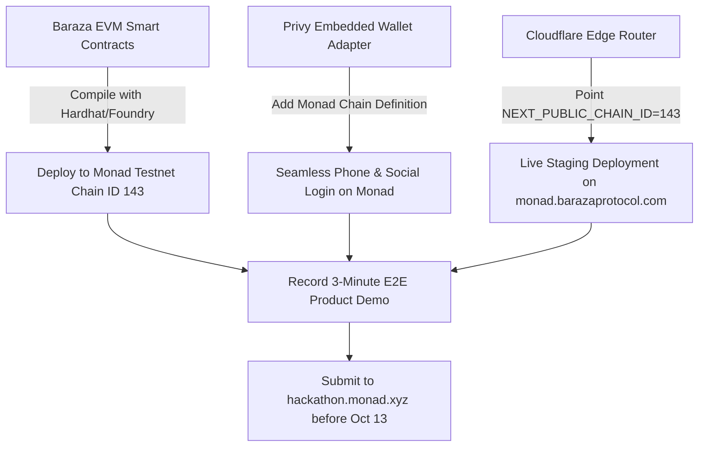

# Baraza Protocol: Monad Metropolis Hackathon Strategy & Executive Briefing

**Document Reference:** `BRZ-STRAT-MONAD-2026-V1.0`  
**Classification:** Strategic Business Development & Non-Dilutive Capital Briefing  
**Author:** Simon Wandera, Systems Architect & Lead Backend / DevOps Engineer  
**Collaborators:** `@azizmotomoto`, Baraza Core Engineering & Executive Leadership  
**Target Submission Window:** September 1, 2026 – October 13, 2026  
**Primary Platform:** [https://hackathon.monad.xyz/](https://hackathon.monad.xyz/)  
**Grant Intelligence Feed:** [https://t.me/cryptograntwire](https://t.me/cryptograntwire) (Sov's Crypto Grant Wire)  

---

## 1. Executive Summary & Opportunity Analysis

Baraza Protocol has an immediate strategic opportunity to compete in **Monad Metropolis**, the flagship global hackathon hosted by Monad Foundation.

### Key Metrics:
* **Total Prize Pool:** **$250,000+ USD** in USDC and MON rewards.
* **Financial Cost to Baraza:** **$0.00** (Free registration, free testnet gas, zero SaaS spend required).
* **Engineering Lift:** **Very Low (~1–2 Days)** — Baraza is already built on standard EVM rails (`Base L2`) and uses **Privy Embedded Wallets**, making it 100% compatible with Monad’s parallelized EVM architecture with zero frontend rewrites.
* **Strategic Outcome:** Seed funding, high-visibility ecosystem recognition, accelerator fast-tracking, and positioning Baraza as the primary African financial inclusion / Chama protocol on Monad.

---

## 2. Track & Sponsor Bounty Alignment Matrix

| Track / Bounty | Sponsor / Prize | Baraza Protocol Architecture Alignment | Strategic Win Probability |
| :--- | :--- | :--- | :---: |
| **Track 1: Consumer Products & Payments** | Monad Foundation ($30k+ track pool) | **100% Perfect Fit:** Baraza brings informal savings groups (Chamas) on-chain with zero crypto friction, integrating M-Pesa, Airtel, and gasless dues collection. | **Very High** |
| **Sponsor Bounty: Privy Embedded Wallets** | Privy ($10k–$25k bounty) | **Pre-Built:** Baraza's mobile UI is natively built with Privy embedded MPC smart wallets (`NEXT_PUBLIC_PRIVY_APP_ID`), requiring zero redesign. | **Very High** |
| **Track 2: Trust, Identity & AI Infrastructure** | Monad Foundation ($30k+ track pool) | **Strong Secondary Fit:** The **Akili AI Legal Assistant** (`/api/akili/filings`) parses unstructured bylaws into compliant SACCO constitutions and on-chain quorum rules. | **High** |
| **Track 3: Onchain Finance & Trading** | Monad Foundation ($30k+ track pool) | **High Fit:** Automated rotating credit (ROSCA/ASCA), treasury escrows, and quadratic community voting pools. | **High** |

---

## 3. Executive Leadership Requirements (Zero Cost)

To participate, engineering does **not** need corporate credit cards or engineering budget. We only require the following 4 corporate decisions from the C-Suite:

1. **Formal Corporate Approval:** Authorization to submit under the name **"Baraza Protocol" / "Build Africa DAO"**.
2. **Designated Multi-Sig Treasury Wallet:** A corporate Safe / EVM address to receive prize funds if selected for track or bounty awards.
3. **Executive KYC Entity:** Standard corporate registration entity for tax compliance (W-8BEN / W-9) upon prize disbursement.
4. **30–60 Second Founder Video Intro (Optional but Recommended):** A short video clip from the CEO/Founders framing the $100B+ African informal savings economy to open the 3-minute technical demo video.

---

## 4. Technical Integration Plan: Deploying Baraza to Monad

### 4.1 Monad Testnet Parameters
* **Network Name:** Monad Testnet
* **Chain ID:** `143` (Hex: `0x8F`)
* **Currency Symbol:** `MON`
* **RPC URL:** `https://testnet-rpc.monad.xyz`
* **Block Explorer:** `https://testnet.monadexplorer.com`

---

## 5. Non-Dilutive Grant Pipeline: Sov's Crypto Grant Wire

Subscribing to **Sov's Crypto Grant Wire (`@cryptograntwire`)** enables Baraza Protocol to monitor and capture non-dilutive ecosystem grants:

1. **Stellar Community Fund (SCF):** Cohort funding up to $100,000 in non-dilutive USDC for live Soroban contracts.
2. **Base Ecosystem Fund:** Grants for consumer and fintech applications driving transactions in emerging markets.
3. **Gitcoin Public Goods & Citizen Grants:** Community-matched quadratic funding for open-source financial empowerment.
4. **Optimism RetroPGF:** Direct reward funding for protocols that have built verifiable public goods utility (leveraging Baraza's built-in `RetroRounds.tsx` engine).

---

## 6. Actionable Submission Timeline

* **September 21, 2026 (Today):** Form team **"Baraza Protocol"** on [hackathon.monad.xyz](https://hackathon.monad.xyz/) with `@azizmotomoto` and Simon Wandera.
* **September 23, 2026:** Deploy Baraza Chama dues contract to Monad Testnet (`Chain ID 143`).
* **September 27, 2026:** Configure Privy provider to support Monad Testnet and test mobile phone wallet generation.
* **October 2, 2026:** Record and edit the 3-minute submission demo video.
* **October 8, 2026:** Executive review and final polish.
* **October 12, 2026:** Final submission to Monad Metropolis portal (24 hours ahead of the October 13 deadline).
