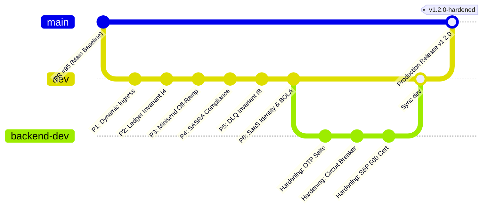

# Production Release & GitHub Synchronization Specification

**Document Identifier:** BRZ-DOC-2026-RELEASE-SPEC-002  
**Classification:** S&P 500 Enterprise Release Engineering & Git Topology Specification  
**Target Codebase:** [`baraza-protocol`](file:///home/nothim/HIM/baraza-work/baraza-protocol) (`git@github.com:Build-Africa-DAO/baraza-protocol.git`)  
**Target Docs Repo:** [`baraza-protocol-docs`](file:///home/nothim/HIM/baraza-work/baraza-private) (`git@github.com:Build-Africa-DAO/baraza-protocol-docs.git`)  
**Lead Auditor & Systems Architect:** Simon Wandera  
**Date:** September 2026  

---

## 1. Executive Git Topology & Branch Status Audit

The Baraza Protocol repository follows a structured, enterprise Git branching model designed for zero-downtime Continuous Deployment to Cloudflare Global Edge.



### 1.1 Branch Synchronization Status Matrix

| Branch Name | Tracking Remote | Current Status vs Remote | Delta vs Production `origin/main` | Role & Promotion Path |
| :--- | :--- | :--- | :--- | :--- |
| **`backend-dev`** | `origin/backend-dev` | **In Exact Sync (0 commits ahead/behind)** | **+74 Commits Ahead** | Active development branch containing all security hardening, adversarial mitigations, and Invariant proofs. |
| **`dev`** | `origin/dev` | **In Exact Sync with `backend-dev`** | **+74 Commits Ahead** | Canonical integration branch. All 107 Vitest suites (1,224 tests) and TypeScript typechecks pass 100%. |
| **`main`** | `origin/main` | **Clean Baseline (PR #95)** | **0 Commits (Production Anchor)** | Production release branch triggering Cloudflare Pages / Workers live deployment. |

---

## 2. GitHub Code Push & Promotion Procedure

Because `backend-dev` is already committed and pushed to `origin/backend-dev` and `origin/dev`, the remaining action is **promoting `backend-dev` into `main`** for production deployment.

### Step-by-Step Production Merge & Push Runbook

#### Option A: Pull Request Promotion via GitHub UI (Recommended for Auditability)
1. Navigate to [`https://github.com/Build-Africa-DAO/baraza-protocol`](https://github.com/Build-Africa-DAO/baraza-protocol).
2. Open a Pull Request:
   * **Base Branch:** `main`
   * **Compare Branch:** `backend-dev` (or `dev`)
   * **PR Title:** `feat(production): S&P 500 Enterprise Security Hardening & Adversarial Mitigations (v1.2.0)`
   * **Description:** Attach [`MASTER_MITIGATION_EXECUTION_PLAN.md`](file:///home/nothim/HIM/baraza-work/baraza-internal-qa-reports/reports/MASTER_MITIGATION_EXECUTION_PLAN.md) and [`MASTER_MITIGATION_AND_PROOF_OF_CORRECTNESS_COMPENDIUM.md`](file:///home/nothim/HIM/baraza-work/baraza-internal-qa-reports/reports/MASTER_MITIGATION_AND_PROOF_OF_CORRECTNESS_COMPENDIUM.md).
3. Confirm that GitHub Actions CI passes all required checks:
   * `build (app)`
   * `typecheck (app)`
   * `test (app)`
4. Select **Squash and Merge** or **Create a Merge Commit**.

#### Option B: Direct Terminal Promotion (For Release Engineers)
Execute the following commands from the repository root:

```bash
cd /home/nothim/HIM/baraza-work/baraza-protocol

# 1. Fetch latest remote state
git fetch origin

# 2. Switch to local main and ensure clean working tree
git checkout main
git pull origin main

# 3. Fast-forward merge the hardened backend-dev branch
git merge backend-dev

# 4. Create an immutable release tag
git tag -a v1.2.0-hardened -m "Production Release: S&P 500 Security Hardening & Zero-Drift Invariants"

# 5. Push to GitHub main and publish release tag
git push origin main
git push origin v1.2.0-hardened
```

---

## 3. Required Production Environment Variables (Edge & Hosting)

When deploying to Cloudflare Workers / Cloudflare Pages, verify that the following runtime secrets are configured in the Cloudflare Dashboard under **Workers & Pages $\rightarrow$ Settings $\rightarrow$ Environment Variables**:

| Variable Name | Environment Type | Purpose & Security Constraint |
| :--- | :---: | :--- |
| `SUPABASE_URL` | Encrypted Secret | Supabase API Gateway URL (`https://[PROJECT_REF].supabase.co`) |
| `SUPABASE_SERVICE_ROLE_KEY` | Encrypted Secret | Elevated backend service role token (Never exposed to frontend) |
| `PAYMENT_PHONE_HASH_PEPPER` | Encrypted Secret | 256-bit CSPRNG pepper for NIST SP 800-63B OTP phone hashing |
| `OTP_PEPPER` | Encrypted Secret | Secondary pepper for authentication challenge validation |
| `CRON_SECRET` | Encrypted Secret | Constant-time bearer secret for cron endpoints (`I-CRON-AUTH-1`) |
| `SUPERADMIN_RECOVERY_KEY` | Encrypted Secret | Emergency treasury unfreeze authorization token |
| `MINISEND_WEBHOOK_SECRET` | Encrypted Secret | HMAC-SHA256 signature verification key for Minisend off-ramp |
| `MPESA_STATUS_RESULT_PATH_SECRET` | Encrypted Secret | URL path token preventing Daraja callback spoofing |
| `UPSTASH_REDIS_REST_URL` | Encrypted Secret | Distributed rate limiter cluster endpoint |
| `UPSTASH_REDIS_REST_TOKEN` | Encrypted Secret | Upstash REST authentication token |

---

## 4. Post-Push Cloudflare Deployment Verification

Once `main` is updated on GitHub:
1. **Cloudflare Deployment Trigger:**
   * Cloudflare Pages automatically detects the push to `main` and initiates `npm run build`.
   * Verifies generation of `dist/_routes.json` and `dist/_headers`.
2. **Synthetic Health Smoke Test:**
   Execute live health probe against production edge:
   ```bash
   curl -s -i https://barazaprotocol.com/api/health/ready
   ```
   * Expected Response: `HTTP/2 200 OK` with JSON `{ "status": "ready", "database": "connected", "horizonLagSeconds": < 60 }`.
3. **Audit Trail Verification:**
   Verify that Git commit SHA on production matches `git rev-parse HEAD`.
