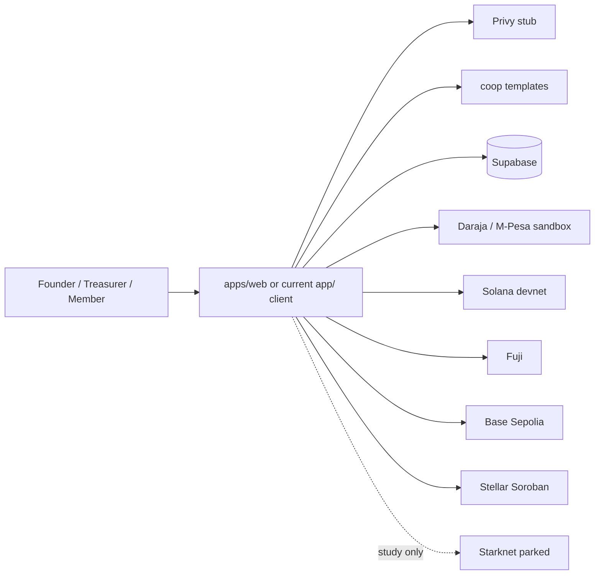
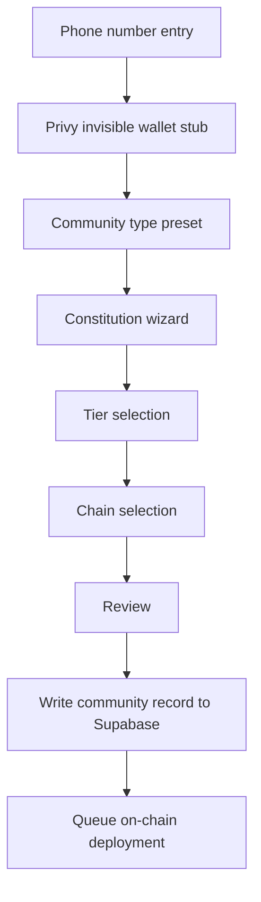
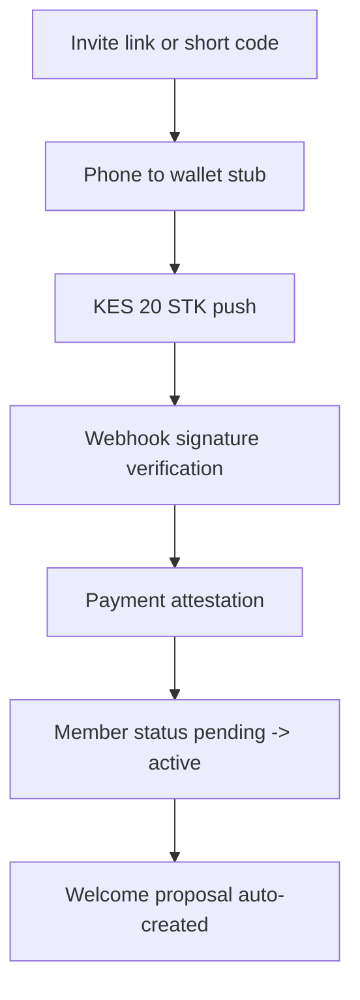
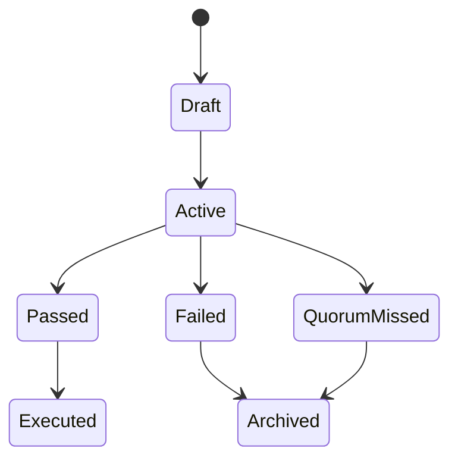
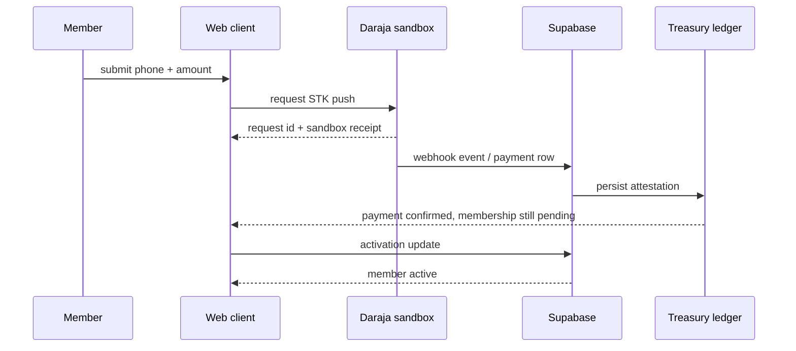
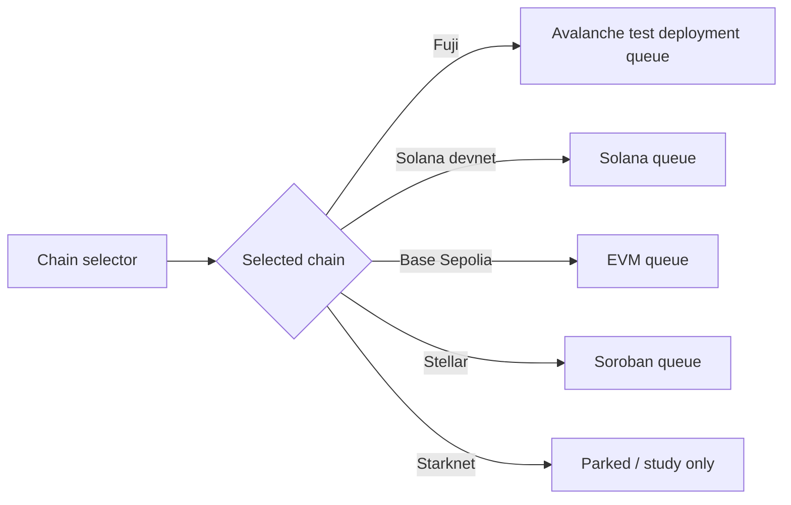

# Baraza Protocol Architecture

This document defines the working target for the multi-chain sprint.

Current runnable client surface remains the existing `app/` Vite app in this checkout, but the intended layout is:

- `/apps/web` - Next.js app shell and onboarding / operational UI
- `/packages/integrations` - shared integration adapters and sandbox stubs
- `/packages/coop-templates` - community preset and constitution templates
- `/programs` - Solana programs
- `/contracts` - Stellar and EVM contracts
- `/vendor` - pinned audited primitives
- `/supabase` - schema, RLS, and edge workflow SQL

## System map

## Onboarding flow

## Activation payment flow

## Proposal lifecycle

## M-Pesa to treasury attestation

## Cross-chain deployment selection

## Environment matrix

| Environment | Frontend runtime | Chain keys | Payment keys | Supabase | Notes |
| --- | --- | --- | --- | --- | --- |
| Local | `app/` dev server | mocked / local RPC only | sandbox Daraja + simulator | optional anon key; local fallback if absent | No real secrets required |
| Devnet-staging | Vercel preview or local preview | devnet / testnet / sandbox | sandbox only | anon key in Vercel; service role only in vault or server env | Used for QA and demo flows |
| Production | Vercel production | live chain keys only in server-controlled stores | live Daraja / provider secrets outside repo | Supabase vault + server env only | Never commit secrets |

Rules:

- Secrets never live in git.
- Vercel env stores frontend-visible non-secret values.
- Supabase vault stores provider secrets and webhook signing keys.
- Browser code only sees public endpoints and public IDs.

## CI workflow

PR checks should include:

- existing status checks
- `anchor test`
- `soroban test`
- `npm run typecheck`

The workflow should fail fast on schema drift, contract test regressions, or frontend type errors.

## Chain coverage

Active chains:

- Fuji
- Solana devnet
- Base Sepolia
- Stellar Soroban

Parked study chain:

- Starknet

The vendor registry and architecture doc must both reflect the same active-chain coverage.
