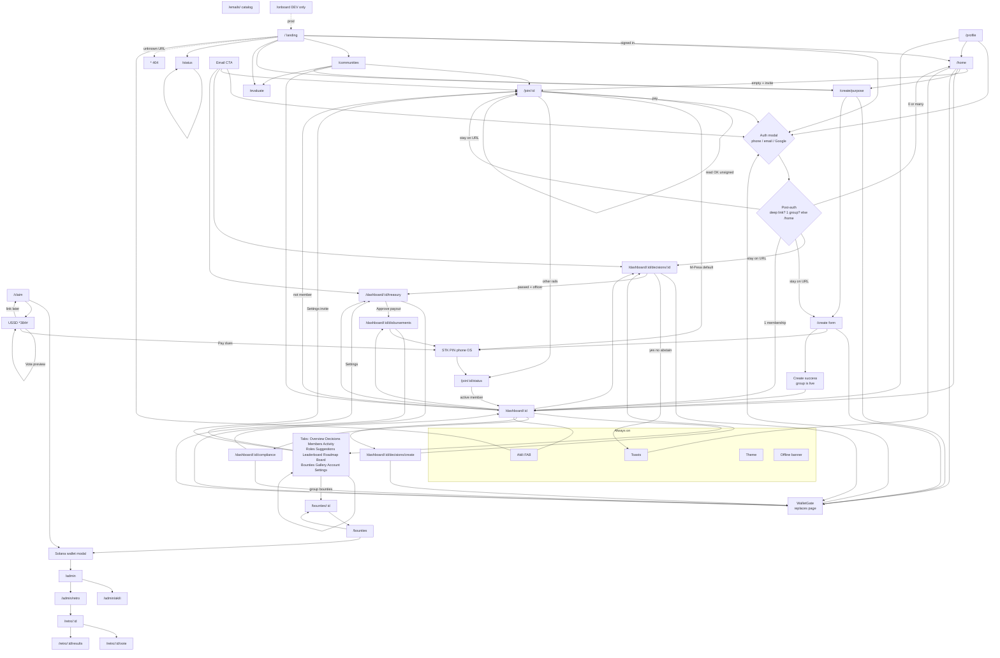
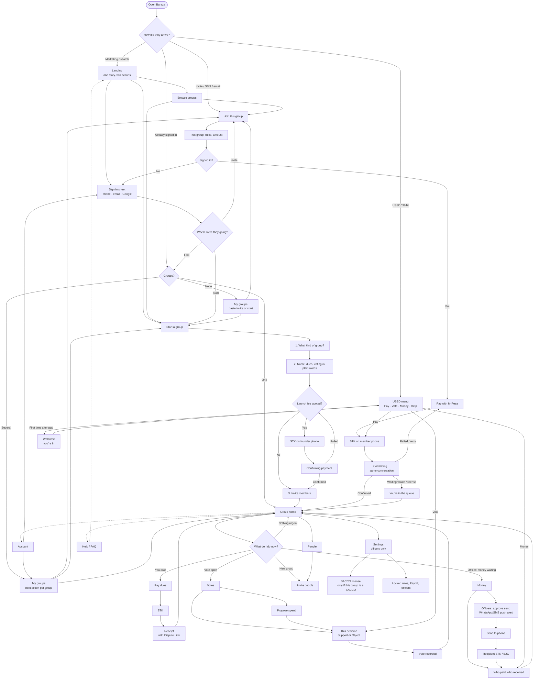

# Baraza frontend — complete screen map

**Date:** 8 September 2026  
**Scope:** Everything a person can see in this product: routed pages, dashboard tabs, overlays, gates, emails, USSD, and UI that exists in code but is not mounted.  
**Source of truth:** `app/src/App.tsx` plus every page and overlay under `app/src`.  
**Purpose:** Inventory for a from-scratch redesign. This is not a redesign plan.

How to read it:

- **Live** = mounted on a URL or always present in chrome.
- **Nested** = a distinct view inside a page (tabs, steps, empty/error).
- **Overlay** = modal, drawer, menu, toast, floating widget.
- **Unmounted** = component files that still exist but no route imports them.

---

## 1. Two shells (every page sits in one)

The app is not one layout. Signed-out and signed-in people get different chrome.

### 1.1 Public shell (`Layout` when not authenticated)

File: `app/src/components/Layout.tsx` → `PublicShell`

Always on:

| Piece | File | What it is |
|---|---|---|
| Skip link | Layout | “Skip to main content” |
| Header | `Header.tsx` | Logo, Groups / How it works / Features / FAQ, theme toggle, Sign in / Sign up, hamburger |
| Offline banner | `OfflineBanner.tsx` | Full-width bar when `navigator` is offline |
| Main | — | Page body, extra bottom pad for mobile nav |
| Footer | `Footer.tsx` | Product / For groups / Company columns |
| Mobile bottom nav | `MobileBottomNav.tsx` | Home, Groups, Launch FAB, Profile, Log in / Account |
| Backend pill | `BackendStatus.tsx` | Dev-only, desktop: “Supabase live” or “Local mock” |

### 1.2 Signed-in app shell (`AppShell`)

File: `app/src/components/app/AppShell.tsx`

Always on:

| Piece | What it is |
|---|---|
| Left sidebar (desktop) | Logo → My Groups, Browse, Launch a Group → list of up to 8 groups → if URL is a group, nested `GroupSidebarNav` → theme + account + log out |
| Mobile top bar | Menu button, logo, account |
| Mobile sidebar drawer | Same as left sidebar, slides over |
| Offline banner | Same as public |
| Backend pill | Same as public, desktop only |
| No public header/footer | Footer and marketing header are gone |

### 1.3 Group sidebar (inside a group URL)

File: `app/src/components/app/GroupSidebarNav.tsx`  
Shown in AppShell when path is `/dashboard/:id…` or `/dao/:id…`

Primary: Overview, Decisions, Members, Activity  
Always-on extra links: Funds, Payouts, Compliance  
More: Roles, Suggestions, Leaderboards, Roadmap, Board, Bounties, Gallery, Account, Settings  
CTA: New proposal (member) or Join group (visitor)

---

## 2. Global overlays (not a URL)

These can appear on top of almost any page.

| # | Overlay | File | How it opens | States |
|---|---|---|---|---|
| G1 | **Auth modal** | `components/auth/AuthModal.tsx` | `account.login()` or `createAccount()` | Intent: Sign in **or** Sign up. Method: Phone (default if enabled) or Email. Step: identifier → 6-digit code. Also Google OAuth button. Country dial: KE, RW, TZ, UG, ET, NG, GH, ZA, GB, US. Image pane hidden on small screens. |
| G2 | **Wallet gate** | `components/auth/WalletGate.tsx` | Any `Layout gate={…}` page while logged out | Loading account → card with Log in / Sign up. Not a modal; it **replaces** the page body. |
| G3 | **Solana wallet modal** | `BarazaWalletModalProvider.tsx` | `useWalletModal().setVisible(true)` | List of wallets (Phantom, Solflare, Coinbase, Backpack, Ledger, Trezor, others). Used on admin, claim, bounties, retro. |
| G4 | **Akili chat** | `akili/AkiliChat.tsx` | FAB on every route | Collapsed FAB → panel. Agents: Akili, Nia, Kofi, Zara, Amara, Seku. Greeting changes by route. |
| G5 | **Ask Akili chip** | `akili/AskAkili.tsx` | Buttons on Profile, Create community, empty memberships | Opens G4 with a canned prompt |
| G6 | **Toasts** | `ui/toaster.tsx` | Vote, pay, save, errors | Stack of toast cards |
| G7 | **Page loader** | `PageLoader.tsx` | Route lazy-load, community fetch | Full-page spinner |
| G8 | **Error boundary** | `AppErrorBoundary.tsx` | Render crash | Status page “server” (500) with retry |
| G9 | **Header profile menu** | `Header.tsx` | Avatar (public shell, signed-in, desktop) | Account, Launch a group, Fund/chain selector, Log out |
| G10 | **Header mobile menu** | `Header.tsx` | Hamburger | Same links + auth/theme |
| G11 | **Chain selector popover** | `ChainSelector.tsx` | Header fund menu / create form | Dropdown of visible chains (Stellar, M-Pesa, Solana, Celo, …) |
| G12 | **AppShell mobile drawer** | `AppShell.tsx` | Menu on signed-in mobile | Workspace nav |
| G13 | **Dashboard mobile tab sheet** | `CommunityDashboard.tsx` | “Overview ▾” on small screens | Accordion of group sections |
| G14 | **Theme toggle** | Header / AppShell | Sun/moon | Light / dark (not a page) |
| G15 | **Post-auth redirect** | `PostAuthRedirect.tsx` | Invisible | After login: stay on deep link, else 1 group → dashboard, else `/home` |

WalletGate copy (same card, different headline) when a page sets `Layout gate`:

| Page | Title |
|---|---|
| `/home` | Sign in to see your groups |
| `/create`, `/create/purpose` | Sign in to launch a group |
| `/dashboard/:id/decisions/create` | Sign in to propose |
| `/dashboard/:id/decisions/:id` | Sign in to vote |
| Treasury / disbursements / compliance | Sign in to continue (default) |

Join (`/join/:id`) is **not** Layout-gated. Visitors can read the join page; pay buttons call `account.login()`.

### 2.1 Inline expanders (not global, still distinct UIs)

These open on the page they live on. Treat them as popups when redesigning.

| UI | File | Where |
|---|---|---|
| Post bounty form | `Bounties.tsx` | `/bounties` toggle |
| Submit work / assign worker | `BountyBoard.tsx` | Group bounties tab |
| Submit idea form | `CommunitySuggestions.tsx` | Suggestions tab |
| Add milestone form | `CommunityRoadmap.tsx` | Roadmap tab |
| Other payment rails | `JoinDao.tsx` | Collapsed until “other ways to pay” |
| FAQ accordion | `FaqSection.tsx` | Landing `#faq` |
| Member contribution history | `MemberDirectory.tsx` | Expand a row |
| Header fund/chain dropdown | `ChainSelector.tsx` | Public header when signed in |

---

## 3. Shared status screens (replace a page)

File: `components/StatusPage.tsx` + `lib/statusPages.ts`

| Kind | Code | When |
|---|---|---|
| not-found | 404 | Unknown URL (`NotFound.tsx`) |
| community | 404 | Unknown group id |
| bounty | 404 | Unknown bounty id |
| proposal | 404 | Unknown proposal id |
| unauthorized | 401 | Copy exists; Sign in CTA |
| forbidden | 403 | Admin / reserved |
| server | 500 | API/community load fail, error boundary |
| offline | Offline | Copy exists |

`NotFound.tsx` is just `StatusScreen kind="not-found"`.

---

## 4. Routed pages (every URL)

Redirects first (not screens):

| URL | Goes to |
|---|---|
| `/` if signed in | `/home` |
| `/proposals` | `/communities` |
| `/vote` | `/communities` |
| `/onboarding` | `/onboard` |
| `/dao/:id`, `/dao/:id/proposals`, `/dao/:id/vote` | Same as dashboard (legacy aliases) |

Who can open the URL:

| Access | URLs |
|---|---|
| Public | `/`, `/communities`, `/bounties`, `/bounties/:id`, `/evaluate`, `/status`, `/join/:id`, `/join/:id/status`, `/dao/:id…`, `/dashboard/:id` (tabs), `/profile` (signed-out pitch), `/claim`, `/admin*` (403 card if wallet not allowlisted), `/retro…`, `/onboard` (prod → `/`) |
| Must be signed in (WalletGate) | `/home`, `/create/purpose`, `/create`, `/dashboard/:id/decisions/create`, `/dashboard/:id/decisions/:id`, `/dashboard/:id/treasury`, `/dashboard/:id/disbursements`, `/dashboard/:id/compliance` |
| Wallet allowlist | `/admin`, `/admin/akili`, `/admin/retro` |
| Production hidden | `/onboard` redirects to `/` |

### 4.1 Marketing — `/` — `Index.tsx` — visitors only

Landing is a long scroll, not one card. Sections (in order):

| # | Anchor | File | Contents |
|---|---|---|---|
| L1 | (top) | `HeroSection.tsx` | Headline, Collect / Vote / Release strip, Polaroid photos, logo marquee, primary CTAs |
| L2 | `#features` | `FeaturesSection.tsx` | Feature grid |
| L3 | `#who-its-for` | `AIPlatformSection.tsx` | Who it’s for (chamas, SACCOs, coops) |
| L4 | `#how-it-works` | `FlowWalkthrough.tsx` | Step walkthrough |
| L5 | `#faq` | `FaqSection.tsx` | Accordion FAQs |
| L6 | (bottom) | `CTASection.tsx` | Final launch / browse CTA |

Signed-in users never see this; they bounce to `/home`.

Footer also links `#how-it-works`, `#features`, `#faq`, `#who-its-for`.

### 4.2 My groups — `/home` — `Home.tsx` — gated

| State | What you see |
|---|---|
| Loading | Pulse cards |
| Has memberships | Grid of group cards → `/dashboard/:id` |
| Empty | **Join with invite** form + **Launch a group** card |
| Error | Error banner |

Invite form accepts URL, `?invite=` code, or group id.

### 4.3 Browse — `/communities` — `Communities.tsx` — public

- Banner
- Search (`?q=`)
- Type filter (all + every `COMMUNITY_TYPES`)
- Grid **or** list
- `CommunityCard` grid
- Empty: no groups / no search match
- Launch CTA

### 4.4 Evaluate — `/evaluate` — `Evaluate.tsx` — public

Static checklist (membership, treasury, voting, records). Score legend. “AI review” explanation rows. **Not** a live scorer.

### 4.5 Choose purpose — `/create/purpose` — `CommunityPurpose.tsx` — gated

Multi-select: Monthly savings, Community service, Social gathering, Business ventures. Continue → `/create?type=…`. Most of the multi-select is discarded; first pick sets type.

### 4.6 Launch group — `/create` — `CreateCommunity.tsx` — gated

Query: `?type=savings|sacco|cooperative|…`

**View A — form** (one long page + sticky checklist):

1. Name, description, image/initials  
2. Group type (27 types: Chama, Savings Group, Stokvel, SACCO, DAO, Cooperative, Professional Network, Investment Club, ROSCA, ASCA/VSLA, Union, NGO, Alumni, Religious, Sports, Homeowners, Burial Society, Tribe/Clan, Welfare, PTA, Youth, Political Caucus, Supply Chain Cooperative, Study Circle, Housing SACCO, Organization, Government)  
3. Governance: quorum, approval, voting days, treasury policy  
4. Activation fee (empty default, or free)  
5. Verification tier 1–4: activation / vouching / phone / proof of personhood  
6. SACCO/coop/housing: warning + CS/SASRA number, file, HTTPS URL  
7. Add-ons: M-Pesa Paybill, USSD  
8. Settlement chain selector  
9. Launch payment: Mobile money / WhatsApp / Privy wallet / SWIFT  
10. Phone field when rail needs it  
11. Fee breakdown (setup 6500 KES + add-ons)  
12. Ask Akili chips  

**View B — success:** “{name} is live”, Paybill/USSD assigned, go to dashboard / copy join link.

### 4.7 Join — `/join/:id` — `JoinDao.tsx` — gated for pay

| Nested view | When |
|---|---|
| Community missing | Status: community |
| Activation tracker | Always (step 1 of 6 visual) |
| Fee breakdown | Tier 1, not free |
| Vouching wait | Tier 2 |
| Proof of personhood | Tier 4 |
| Phone verification | Tier 3 |
| M-Pesa STK (default) | Phone + STK copy |
| Other rails (collapsed) | On-chain tx hash, Privy wallet, card |
| Login required | WalletGate |

Query: `?invite=` triggers accept.

### 4.8 Join status — `/join/:id/status` — `JoinStatus.tsx`

Query: `orderId`, `rail=mpesa|stellar|wallet`

Stepper: preparing credential → recording → verified → active member. Failure + retry. Membership active at INDEXER_CONFIRMED or RECONCILED.

### 4.9 Group workspace — `/dashboard/:id` — `CommunityDashboard.tsx`

Also: `/dao/:id` (same). Tab via `?tab=` or mobile sheet.

**Always on this page:** group header (name, type, SACCO badge, join/member chip), circuit-breaker banner if frozen, live stat cards (funds, members, proposals, bounties).

| Tab query | Label | Nested UI |
|---|---|---|
| (default) `overview` | Overview | Stats, recent activity, active decisions, Akili review |
| `governance` | Decisions | Filters Active / Passed / Executed / Rejected / Tied. `DecisionCard` list. New proposal. |
| `members` | Members | `MemberDirectory`: search, filters all/active/overdue/officer/founder/admin/member, sort, expand contribution history, CSV export, dues streak chips |
| `activity` | Activity | `ActivityFeed` (longer) |
| `roles` | Roles | `CommunityRoles` permission cards (admin/moderator/member/guest) |
| `suggestions` | Suggestions | Idea feed + submit form + upvote |
| `leaderboard` | Leaderboards | Contributor ranking from bounties |
| `roadmap` | Roadmap | Kanban: planned / in progress / completed + add milestone |
| `combined` | Board | Mixed bounty + proposal feed |
| `bounties` | Bounties | `BountyBoard` list **or** kanban; apply; submit work; assign; approve/revise |
| `gallery` | Gallery | `CommunityGallery` image grid |
| `wallet` | Account | Group funds snapshot + signed-in account card |
| `settings` | Settings | See cards below |

**Settings tab cards** (`CommunitySettings.tsx`):

1. Community identity — name, type, payment setup, founded, copy community ID  
2. Governance parameters (locked) — quorum, approval, voting period, treasury policy  
3. Membership — monthly dues, member count, your status  
4. Payment channels — M-Pesa Paybill (active or “Add for KES”), USSD shortcode (same)  
5. Admin actions — Transfer admin (Locked), Update rules (Locked), Create community token (Coming soon), Manage treasury (Open → `/treasury`), Export member list (Locked)

**Officer admin** on the same tab if the viewer is a member (`OfficerAdminPanel.tsx`):

- Generate invite — expiry days, max uses, copy `/join/:id?invite=` link  
- Statement CSV — start/end dates, download  
- File payment dispute — order id, type (not credited / wrong amount / duplicate / other), reason, amount  
- Leadership — wallet, role founder/admin/treasurer/member, ASSIGN or REVOKE  

### 4.10 New proposal — `/dashboard/:id/decisions/create` — `CreateDecision.tsx` — gated

Form: title, description, funding amount, duration. Token-gate copy. Submit.

### 4.11 Proposal — `/dashboard/:id/decisions/:decisionId` — `ProposalDetail.tsx` — gated

- Stage badge, description, funding, quorum bar (yes/no/abstain)  
- Vote yes / no / abstain  
- Tied / deadlock copy  
- Execute (passed/queued; locked if frozen)  
- Comments  
- Akili security review  
- Activity / audit trail  

Missing proposal → status: proposal.

### 4.12 Group funds — `/dashboard/:id/treasury` — `TreasuryDetail.tsx` — gated

- KES pool  
- Multisig “n of 3 officers”  
- Circuit-breaker banner  
- Officer reconciliation note + link to compliance (when frozen)  
- Contributions empty state  
- Pending releases + **Approve payout**  
- Completed releases  
- Export CSV  
- Link to Send payout  
- Audit trail copy  

### 4.13 Payouts — `/dashboard/:id/disbursements` — `Disbursements.tsx` — gated

- Phone (E.164 KE/UG/GH/NG)  
- USDC amount, quoted FX, 150 bps slippage note  
- Rail: M-Pesa, MTN, Airtel, Bank  
- Tranche wizard if > KES 250,000  
- Send payout (disabled when frozen)  
- Lifecycle stepper: OFFRAMP_INITIATED → PROVIDER_PENDING_VERIFICATION → SETTLED / FAILED / REVERSAL_DETECTED  
- Kotani failover badge  
- Receipt + amount on settle  

### 4.14 SACCO compliance — `/dashboard/:id/compliance` — `SaccoCompliancePortal.tsx` — gated

- Status badge (Verified / Pending / Unlicensed / Expired / Revoked)  
- License number, file picker, HTTPS URL, future expiry  
- Submit for SASRA review  
- Lending desk CTA (disabled until verified)  

### 4.15 Profile — `/profile` — `Profile.tsx`

**Logged out:** account pitch, Log in / Create account, country select.

**Logged in:**

- Header: display name, country, log out  
- Participation balance + dues streak  
- Country/currency  
- Identity: name, bio, HTTPS avatar, language en/sw/sheng, SMS/WhatsApp/email/push, enable browser notifications, save  
- Badges  
- Referral progress (empty / list)  
- Memberships list  
- Bounty announcements  
- Voting history  
- Account security copy  

### 4.16 Bounties (global) — `/bounties` — `Bounties.tsx`

- Search, status filter, board / grid / list  
- **Post bounty** form (toggle)  
- Cards: apply, submit work, status columns  
- Opens Solana wallet modal if posting requires wallet  

### 4.17 Bounty detail — `/bounties/:bountyId` — `BountyDetail.tsx`

Brief, status, reward, deadline, group link, submissions, submit work, Akili review. Missing → status: bounty.

### 4.18 System status — `/status` — `StatusDashboard.tsx` — public

Overall ready/degraded/not_ready. Rails: PostgreSQL, Stellar Horizon, Kotani/Minisend (inferred). Links to `/api/health/metrics` and `/live`.

### 4.19 Link phone — `/claim` — `ClaimIdentity.tsx`

Requires Solana wallet (opens wallet modal). Steps: phone → SMS code → done. USSD-initiated members also land here with a code.

### 4.20 Leverage lab — `/onboard` — `LeverageOnboarding.tsx`

**Production:** redirects to `/`.  
**Dev only:** giant testbed — EN/SW, community create, STK activation, USSD session, welcome proposal, batch activation, chain/tier/payout/halal, coop templates.

### 4.21 Admin — `/admin` — `AdminReconciliation.tsx`

Wallet allowlist (or 403). Sections: metrics, community security reviews, bounty moderation, **hardcoded** payment-order table, mint jobs, knowledge graph. Connect wallet modal.

### 4.22 Akili filings — `/admin/akili` — `AkiliCouncilFilings.tsx`

Admin-gated. Per-agent filings / listening notes / corrections.

### 4.23 Retro admin — `/admin/retro` — `RetroRounds.tsx`

Admin-gated. Open BRZA retro rounds per community.

### 4.24 Retro group — `/retro/:communityId` — `RetroCommunity.tsx`

Active round, pool, vote / results links. Wallet modal for actions.

### 4.25 Retro vote — `/retro/:communityId/vote` — `RetroVote.tsx`

Ballot: allocate pool across recipients. Submit.

### 4.26 Retro results — `/retro/:communityId/results` — `RetroResults.tsx`

Allocations + settlement status.

### 4.27 Catch-all — `*` — `NotFound.tsx`

404 status screen.

---

## 5. Cards and widgets reused as mini-UIs

These are not routes but they are full interactive UIs:

| Widget | File | Where |
|---|---|---|
| Community card | `CommunityCard.tsx` | Browse |
| Decision card | `DecisionCard.tsx` | Dashboard decisions — yes/no/abstain, quorum bar, tied copy |
| Member directory | `MemberDirectory.tsx` | Members tab |
| Bounty board | `BountyBoard.tsx` | Group bounties tab — list/kanban, drag-drop status |
| Activity feed | `ActivityFeed.tsx` | Overview + activity tab |
| Live stat card | `LiveStatCard.tsx` | Overview |
| Invite QR panel | `InviteLink.tsx` | **Unmounted** (see §8) |
| SACCO badge | `SaccoComplianceBadge.tsx` | Dashboard header, compliance page |
| Circuit-breaker banner | `TreasuryCircuitBreakerBanner.tsx` | Dashboard, treasury, disbursements |
| Dues streak chip | `DuesStreakChip.tsx` | Profile, members |
| Member badges | `MemberBadges.tsx` | Profile |
| Referral progress | `ReferralProgress.tsx` | Profile |
| Akili security review | `akili/AkiliSecurityReview.tsx` | Dashboard, proposal, bounty detail |
| Community banner | `CommunityBanner.tsx` | Many pages |
| Polaroid gallery | `PolaroidGallery.tsx` | Landing hero |
| Logo marquee | `LogoMarquee.tsx` | Landing hero |

---

## 6. Email UIs (not the React app, still product surfaces)

Local catalog UI (not in React Router): `http://localhost:5173/emails/` → `app/public/emails/index.html` — dark sidebar, Auth vs Notifications groups, iframe preview of the 13 templates.

| Template | Preview file | When it is sent (intended) |
|---|---|---|
| Sign up code | `preview/signup-otp.html` | Sign up OTP |
| Sign in code | `preview/signin-otp.html` | Sign in OTP |
| New sign in | `preview/signin-new-session.html` | New session |
| Account created | `preview/account-welcome.html` | After sign up |
| Vote recorded | `preview/vote-cast.html` | After vote |
| Dues reminder | `preview/dues-reminder.html` | Cron |
| Membership active | `preview/member-welcome.html` | Join complete |
| New proposal | `preview/proposal-created.html` | Proposal opened |
| Payment confirmed | `preview/payment-confirmed.html` | Payment |
| Activate membership | `preview/membership-activate.html` | Pay to activate |
| Group invite | `preview/community-invite.html` | Invite |
| Payout needs approval | `preview/payout-approval.html` | Officer approve |
| Payout settled | `preview/payout-settled.html` | Off-ramp settled |

HTML + text sources: `app/emails/html`, `app/emails/text`, `app/emails/catalog.json`.

---

## 7. Non-browser member UI

These are screens too. A from-scratch redesign of “all views” includes them.

### 7.1 USSD — `app/src/lib/ussd/menu.ts` + `welcome.ts`

Main menu (`*384#` copy in product):

```
Baraza
1. My Balance
2. Vote
3. Pay Dues
4. Community
5. Help
```

| Path | Screens |
|---|---|
| 1 Balance | BRZA amount → Refresh / Back → END copy pointing at baraza.app |
| 2 Vote | Active proposals list → For / Against / Abstain → Confirm yes/no → **preview only** (“USSD voting opens soon”) |
| 3 Pay dues | Enter community code → Amount 100 KES Confirm/Cancel → Processing + SMS |
| 4 Community | My communities list → member count + Contact admin → admin phone |
| 5 Help | Vote & pay via USSD, web baraza.app, Support `*384*0#` |

**Welcome flow** (first dial after USSD-originated mint, Nia):

| Screen | Copy gist |
|---|---|
| W0 | Karibu + community + payment confirmed → See what this means / Main menu |
| W1 | Your voice counts + example proposal |
| W2 | Dues months paid |
| W3 | Later: link a wallet; for now the phone is membership |
| Exit | Welcome complete / returning to menu |

### 7.2 Other phone OS surfaces

| Surface | Where | Notes |
|---|---|---|
| SMS OTP | Africa’s Talking | Auth (Privy today), identity claim, unmounted Onboarding |
| STK PIN sheet | Safaricom (phone OS) | Join + launch + payouts — not our pixel, but part of the flow |
| M-Pesa Paybill | Assigned on create | Shown on create success + settings |

---

## 8. Built in code, not mounted on any route

If you redesign “everything on screen today,” these do **not** appear unless you wire them. They still exist and will confuse a visual audit of the folder.

| File | What it is | Why it’s listed |
|---|---|---|
| `pages/Onboarding.tsx` | Phone → OTP → welcome (old flow) | **Not in `App.tsx`**. `/onboard` is LeverageOnboarding. |
| `components/onboarding/PhoneEntry.tsx` | Phone field | Only used by unmounted Onboarding |
| `components/onboarding/OtpVerify.tsx` | OTP | Same |
| `components/onboarding/WelcomeScreen.tsx` | Welcome | Same |
| `components/onboarding/CsvImport.tsx` | CSV member import modal | Not imported by any page |
| `components/ShowReelSection.tsx` | Video reel section | Not on Index |
| `components/CommunityMarquee.tsx` | Community logo marquee | Not on Index |
| `components/WalletStatus.tsx` | Full Solana + Stellar connect panel | Not imported |
| `components/MembershipCard.tsx` | Membership credential card | Not imported |
| `components/community/InviteLink.tsx` | Copy/share/QR invite | Not imported (officer panel generates links instead) |
| `components/EnvironmentSelector.tsx` | Dev/prod environment switch | Not imported |

---

## 9. End-to-end journeys (screens in order)

Use this when redesigning flows, not folders.

1. **Visitor → member**  
   `/` → Auth modal → `/home` (empty) → invite or `/communities` → `/join/:id` → STK → `/join/:id/status` → `/dashboard/:id`

2. **Visitor → founder**  
   `/` → Auth → `/create/purpose` → `/create` → success → `/dashboard/:id` → settings / new proposal

3. **Member votes**  
   `/dashboard/:id?tab=governance` → DecisionCard or `/dashboard/:id/decisions/:id` → yes/no/abstain → toast

4. **Officer pays out**  
   `/dashboard/:id/treasury` (approve) → `/dashboard/:id/disbursements` → STK on recipient phone → settled stepper

5. **SACCO**  
   Create (license) or `/dashboard/:id/compliance` → badge on dashboard header

6. **Bounty worker**  
   `/bounties` or group Bounties tab → `/bounties/:id` → submit work

7. **Operator**  
   Connect wallet modal → `/admin` → `/admin/akili` or `/admin/retro`

8. **Retro BRZA**  
   `/retro/:id` → `/vote` → `/results`

9. **Identity**  
   Wallet modal → `/claim` (phone + SMS) and/or USSD

---

## 10. Count (for the redesign)

| Kind | Live count |
|---|---|
| Distinct URL pages | 27 (plus aliases/redirects) |
| Landing sections | 6 |
| Group dashboard tabs | 13 (+ Funds / Payouts / Compliance as sibling routes) |
| Settings cards | 5 + officer admin (4 tools) |
| Auth modal combinations | 2 intents × 2 methods × 2 steps + Google |
| Status page kinds | 8 |
| Email templates | 13 (+ catalog index at `/emails/`) |
| Global overlays | 15 |
| Inline expanders | 8 |
| USSD screens | Main + 5 branches + 4 welcome screens |
| Unmounted UIs | 11 files |

If a redesign starts from “what members actually hit,” start with §9 journeys 1–5 and the two shells in §1. Admin, retro, leverage lab, and unmounted files are separate products sitting in the same SPA.

---

## 11. Current user flows (as built)

One map of how people actually move through the product today. Solid lines are the live SPA. Dashed lines are phone OS or email, not our screens. `/onboard` is drawn because the route exists; production sends it to `/`.



How to read it:

1. Everyone starts on `/`, a deep link, USSD, or an email. Signed-in people never stay on `/`; they go to `/home` or a group.
2. **Auth** is one modal. Gated pages (`/home`, launch, propose, vote, treasury, payouts, compliance) swap the body for WalletGate until that modal succeeds. Join is readable unsigned; pay opens the modal.
3. After login, PostAuthRedirect either keeps the current URL, sends a one-group member to that dashboard, or drops everyone else on `/home`.
4. **Founders** go purpose → create → STK for the 6500 KES launch fee → success → dashboard.
5. **Members** go browse or invite → join → STK (or other rail) → status stepper → dashboard.
6. **Inside a group**, tabs stay on `/dashboard/:id?tab=`. Money and compliance are sibling URLs. Propose and vote are nested URLs.
7. **Payouts** are treasury “Approve” then the disbursements page, then STK on the recipient’s phone.
8. **Bounties** exist twice: global `/bounties` and the group Bounties tab. Both can open `/bounties/:id`.
9. **Admin / retro / claim** need the Solana wallet modal, not the phone/email account.
10. **USSD** is a parallel product: welcome, balance, vote (preview), dues, community, help. It can hand someone to `/claim` later.
11. Akili, toasts, theme, and the offline banner sit on top of every SPA route. They do not change the path.

---

## 12. Proposed user flows (target)

This is the product as it should feel. It is not what ships today. It is informed by: the current map in §11, the 7 September redesign principles (one job per screen, phone first, roles change composition not URLs), the PRD jobs (join → pay → vote → release), and how chama / SACCO / VSLA apps in East Africa actually get used — STK on the phone, interrupted sessions, feature phones, one group at a time, treasurer vs member.

### What “good” means here

Members do four things: **get in, pay, vote, see the money**. Officers do one extra thing: **send money after a vote**. Everything else is later, officer-only, or not this product.

Rules used to draw this:

1. **One question per screen.** If the user has to hunt, the screen failed.
2. **Resume, don’t restart.** Invite, STK, and “confirming…” are the same conversation. Deep links return to the step they were on.
3. **One identity.** Phone or email is the account. No Solana modal for members. No second “wallet gate” page — the same sign-in sheet.
4. **One group at a time.** If they belong to one group, skip the group picker. Home *is* that group.
5. **Next action on top.** Group home is a to-do, not a feature catalog: Pay, Vote, Wait, or Invite.
6. **Same verbs on USSD and web.** Pay / Vote / Money / Help.
7. **Hide until needed.** SACCO license, payouts, settings, bounties, roadmap — not in the member’s way on day one.
8. **Truthful pending.** STK and settlement stay pending until the server says otherwise. No fake “you’re in.”

### What to drop, merge, or hide (vs §11)

| Today | Proposed |
|---|---|
| Marketing retold 4 times + `/evaluate` | One short landing: story → browse or start. Evaluate becomes FAQ. |
| `/create/purpose` then a discarded multi-select | Type is **step 1 of launch**, one choice: Chama, SACCO, Cooperative, Welfare, Investment |
| 12-field `/create` + 4 fake rails | 3 steps: type → name & dues + defaults → pay if the server quotes a fee |
| Join page + separate status page as two products | **One join flow** with stages (see quote → pay → confirming → in). `/status` is only a shareable receipt |
| 13 dashboard tabs + 3 money URLs | **4 member places:** Home, Pay, Votes, People. Officers get **Money** and **Settings** |
| Treasury vs Disbursements vs Compliance | Members: money trail. Officers: same Money screen with Approvals and Send. Compliance is a Settings task for SACCOs |
| Global `/bounties`, Board, Gallery, Leaderboard, Roadmap, Suggestions | **More** inside the group, not chrome. Do not delete; do not lead with them |
| `/profile` vs dashboard Account tab vs `/claim` | **Account** is one place. Phone is already the login |
| WalletGate vs Auth modal vs wallet modal | One sign-in sheet. Resume previous screen |
| Center Launch FAB for people who already pay dues | Launch is secondary. Paying members see Home / Pay / Votes |
| `/onboard`, retro, admin Akili | Internal / operator. Off the member map |
| Chain selector | Invisible. Settlement is not a member choice |
| Akili as “cleared” | Helper that explains *this* fee or *this* vote. Never a destination |

### Target map



How to read the proposed map:

1. **Arrival is the product.** Invite goes straight to that group. Marketing only has to do two things: browse or start. USSD is the same four verbs, not a fifth app.
2. **Sign-in is a sheet on top of the thing they wanted**, then they continue. Nobody is dumped onto a blank `/home` if they had an invite.
3. **Launch is three steps.** Type is a real choice. Defaults are shown in words (“half of members must vote, two-thirds must say yes”). SACCO paperwork is Settings later, not a wall at birth.
4. **Join does not change rooms to “status.”** Confirming is the same screen with a waiting state. Failed means retry pay. Vouching is a hold, not a dead end.
5. **Group home is the hub.** It answers “what do I do now?” and that is the whole member product. Pay, Votes, People, and (for officers) Money are the only places.
6. **Money is one story:** vote passes → officers approve send → phone receives → trail updates. Members never see “disbursements,” “off-ramp,” or “Horizon.”
7. **Account is for the person** (name, language, notifications, sign out). Group rules live in Settings. Two concepts, not three identity systems.
8. **Help and Akili explain the current step.** They never become a place you “go.” Operator tools (admin, retro, labs) stay off this map.

If a screen is not on this diagram, it is not in the member’s way. Keep the old URL as a redirect until people stop using it.

---

## 13. Proposed UI specification

This is the screen-by-screen spec that implements §12. It is specific: chrome, pages, sections, buttons, states. Copy on titles and buttons is **Title Case**. Body copy stays sentence case.

It keeps the existing Baraza system: Geist, white / black / orange, pill wipe buttons. It does not add a fourth brand colour, a purple AI look, or a second typeface.

### 13.1 Colour and type

| Token | Light | Dark | Job |
|---|---|---|---|
| White | background `#FFFFFF` | ink on orange / primary buttons | Page, cards, primary button hover text |
| Black | ink `#0A0A0A` | page `#000000` | Text, primary button rest fill, borders |
| Orange | `hsl(25 95% 53%)` | same | Brand, CTA wipe, active nav, focus ring. **Not** status. |

Status is **word + icon**, not a new rainbow:

| Status | Treatment |
|---|---|
| Pending | Black outline chip, “Pending” |
| Confirmed | Black fill, white type, “Confirmed” |
| Failed | Outline + “Failed” + Retry |
| Restricted | Lock icon + “On Hold” |
| Offline | Banner, black on white: “You Are Offline” |

Orange is never a traffic light. A pending payment is not an orange badge.

**Type.** Geist. Display for page titles. Tabular numbers for money (`KES 1,200`). Body 14–16px. Button labels 14px, bold, slight tracking.

**Title Case** on: page titles, section headings, nav labels, buttons, chips that are actions, empty-state headings, modal titles. Helper text, receipts, and legal lines stay sentence case.

### 13.2 Buttons (all of them)

Every action that looks like a button uses the existing wipe (`.btn-wipe` / `.btn-wipe-outline`). Hover and keyboard focus are the same: the orange slab wipes in from the left; **label and icon stay visible** (`z-index: 1`, `color: inherit`, hover ink **white**). Never orange type on orange fill. Disabled: no wipe, 45% opacity, rest colours stay.

| Kind | Rest | Hover / focus | When to use |
|---|---|---|---|
| **Primary** | Black fill, white label | Orange fill, **white** label | The one next step on the screen |
| **Outline** | Transparent, black type, 1px black border | Orange fill, **white** label | Secondary: Back, Cancel, Browse |
| **Destructive** | Destructive fill, white label | Orange wipe still, white label | Log Out, Remove Officer |
| **Icon** | No fill | Light surface, black icon | Theme, menu, close, overflow |
| **Text link** | Orange underline on hover | Same | Inline “Why This Amount?” |

Minimum tap: 44px. Primary on mobile is full width. One primary per screen. If two equal actions exist, the design is wrong.

Shared button set (reuse these labels; do not invent synonyms):

| Label | Kind | Typical target |
|---|---|---|
| Sign In | Outline | Header, empty account, join |
| Create Account | Primary | Header, landing |
| Continue | Primary | Wizard next |
| Back | Outline / ghost | Wizard, detail |
| Pay With M-Pesa | Primary | Join, dues |
| Check Your Phone | Disabled primary while STK is out | Join, dues, launch |
| Retry Payment | Primary | Failed STK |
| Open Group | Primary on a group card | My Groups, browse |
| Join This Group | Primary | Browse card, join |
| Start a Group | Outline on member chrome; Primary on empty home | Landing, My Groups |
| Invite People | Primary when the group is empty | Group home, People |
| Copy Link | Outline | Invite |
| Pay Dues | Primary | Group home next action |
| Support | Primary | Vote |
| Object | Outline | Vote |
| Propose a Spend | Outline | Votes list, officers/members who may propose |
| Approve Send | Primary | Officer money |
| Send to Phone | Primary | After approve |
| Save | Primary | Account, settings |
| Log Out | Destructive | Account |
| Close | Icon | Sheets |
| Ask Akili | Outline chip, small | Explains this screen |

### 13.3 Chrome (always on)

There are two shells. Same colours. Same logo. The signed-in shell is not a different product.

#### Visitor top bar (signed out)

White bar, 64px, 1px black/10 border. Sticky.

Left: **Baraza** wordmark (black). Tap → `/`.

Centre (desktop): text links, Title Case, muted until hover (black).

- Groups → `/groups`
- How It Works → `/#how-it-works`
- Help → `/help`

Right:

- Theme icon button (Sun / Moon)
- **Sign In** (outline)
- **Create Account** (primary)

Mobile: logo left, **Sign In** outline, hamburger icon. Hamburger sheet: the three links + **Create Account** primary + **Sign In** outline + theme.

No Launch orb. No chain selector. No “Fund.”

#### Signed-in top bar (mobile)

56px, white.

- Menu icon (opens sidebar drawer)
- Current context title: **My Groups** or the group name (one line, truncate)
- Membership chip if in a group: **Active** / **Pending** / **On Hold**
- Account avatar → `/account`

#### Signed-in sidebar (desktop always; mobile as drawer)

White column, 260px. Black ink. Active item: orange wash at 10% + orange type. Hover on idle items: surface grey, black type. These are **nav rows**, not wipe buttons.

**Workspace block**

1. **My Groups** → `/home`
2. **Browse Groups** → `/groups`
3. **Start a Group** → `/create` — outline row, not the loudest thing on the bar

**Your Groups** (only if ≥1)

- Up to 8 rows: group name + tiny status. Tap → that group’s Home.
- If more than 8: **See All** text link → `/home`

**Group block** (only when the URL is inside a group)

Member rows:

1. **Home**
2. **Pay**
3. **Votes**
4. **People**

Officer extra, under a 10px label **Officer**:

5. **Money**
6. **Settings**

No Bounties, Gallery, Roadmap, Board, Leaderboard, Suggestions, Account-as-tab, Compliance, Payouts, Roles in this list.

**Footer of sidebar**

- **Account** → `/account`
- Theme icon
- **Log Out** (destructive, small)

#### Signed-in mobile bottom nav

Five slots, 64px + safe area, white, top border. Active: orange icon + orange label. Idle: muted. Labels Title Case, 10px.

**If the person is inside a group and is a member (not officer):**

| Slot | Label | Goes to |
|---|---|---|
| 1 | Home | Group home |
| 2 | Pay | Pay |
| 3 | Votes | Votes |
| 4 | People | People |
| 5 | Account | Account |

**If officer in a group:** swap People for **Money**. People stays in the sidebar / group overflow.

**If not in a group:**

| Slot | Label | Goes to |
|---|---|---|
| 1 | Groups | `/home` |
| 2 | Browse | `/groups` |
| 3 | Start | `/create` (outline-style, not a giant FAB) |
| 4 | Help | `/help` |
| 5 | Account | `/account` |

No centre orange orb that screams Launch while someone is trying to pay dues.

#### Always-on extras (not navigation)

- **Offline banner** under the top bar: “You Are Offline. You Can Read. You Cannot Pay or Vote.”
- **Toasts:** black card, white type, orange 3px top edge. Auto dismiss. Action on toast uses outline **View** / **Retry**.
- **Ask Akili:** 40px orange circle, white mark, bottom-right, above the mobile nav. Opens a sheet on the **current** step (“Why Is This Amount KES 500?”). Agents are not a menu of products. Close is an X icon.
- **Dev pill** stays desktop-only in development. Members never see “Supabase.”

### 13.4 Sign-in sheet (one overlay, every gated moment)

Not a full-page gate. Not a marketing poster. Bottom sheet on mobile (max 90vh, inner scroll). Centre card on desktop, max 420px.

**Chrome of the sheet**

- Title: **Sign In** or **Create Account** (toggle text buttons, Title Case)
- Close X
- Methods: **Phone** | **Email** (segmented, orange underline on active)
- **Continue With Google** (outline, full width)

**Phone path**

1. Country prefix (default Kenya +254) + number field
2. **Send Code** (primary, full width)
3. Six boxes for the code
4. **Verify Code** (primary)
5. **Resend Code** (text) after 30s

**Email path**

1. Email field
2. **Send Code**
3. Same verify step

Footer sentence (sentence case): “Phone or email is enough. You do not need a crypto wallet.”

After success: sheet closes, **same URL, next enabled action**. If they were on Join, Pay With M-Pesa enables. If they were on Start a Group, step 1 is waiting.

### 13.5 Shared page atoms

Reuse these on every product page so the app feels like one place.

**Page header**

- Optional **Back** (outline, small)
- Title (display, Title Case)
- One-line subtitle (sentence case)
- Optional primary on the right (desktop only; on mobile it belongs at the bottom of the page)

**Card** (`baraza-card`): white, 1px border, tight radius. Money and votes live in cards. Marketing illustrations do not.

**Amount block:** huge tabular number, currency first (`KES 1,200`), caption under in sentence case.

**Stepper** (join / launch pay / send): circles 1–n, current is orange fill white numeral, done is black, todo is outline. Labels under: **See Group**, **Pay**, **Confirming**, **You’re In**.

**Empty state:** heading Title Case, one sentence, one primary, optional outline.

**Loading:** existing `PageLoader` with a Title Case label: **Loading Group**, **Loading Payment**.

**Error:** existing status screen. Buttons: **Try Again** (primary), **Go Home** (outline).

### 13.6 Landing — `/`

Visitor only. Signed-in people never see this; they go to My Groups or their only group.

**Top bar:** visitor chrome.

**Hero**

- Headline (Title Case): **Group Money You Can See**
- One sentence: pay together, vote before it leaves, keep a trail.
- Example product visual: a small fake-but-labeled **Example** card showing a contribution, a vote, a receipt. Not polaroids of strangers.
- Buttons: **Browse Groups** (outline) · **Start a Group** (primary)

**How a Group Runs** (`#how-it-works`) — three steps only, not four retellings:

1. **Collect** — dues on the phone
2. **Vote** — before money leaves
3. **Release** — to a number everyone can see

No second CTA band here.

**Who It Is For** — three rows: **Chama**, **SACCO**, **Cooperative**. Each row is a card. Button: **Start This Kind of Group** → `/create?type=…`

**FAQ** (five questions, accordion). Heading **FAQ**. Last item links **Email Help** (`hello@barazaprotocol.com`). No “we always listen” heading.

**Close**

- **Browse Groups** outline · **Start a Group** primary

**Footer** (visitor only; signed-in shell has no marketing footer)

Columns:

- Product: **Browse Groups**, **Start a Group**, **How It Works**, **Help**
- For Groups: **Chamas**, **SACCOs**, **Cooperatives**
- Company: **System Status** (`/status`, small), GitHub, **Sign In**

No Evaluate. No Features mega-grid. No logo marquee unless the logos are real partners.

### 13.7 Help — `/help`

Short. Title **Help**. Search field optional later.

Sections: **Paying**, **Voting**, **Starting a Group**, **Lost Phone**, **SACCOs**. Each answer is short. Button **Email Help**. **System Status** outline for operators, not members’ first paint.

### 13.8 Browse Groups — `/groups` (keep `/communities` as redirect)

**Header:** **Browse Groups**. Search placeholder “Search by name”. Type chips (single select): **All**, **Chama**, **SACCO**, **Cooperative**, **Welfare**, **Investment**. Chip selected = black fill white type; idle = outline. Not orange pills.

**View toggle** icon: Grid / List.

**Group card**

- Name (Title Case)
- Type chip
- Member count if real
- Monthly dues if the API sent one
- **View Group** (outline) → group home as visitor
- **Join This Group** (primary) → join

Empty: **No Groups Match**. **Clear Search** outline.

Visitor can open a group home **read-only** (next actions hidden; **Join This Group** sticky at the bottom).

### 13.9 My Groups — `/home`

Gated by the sign-in sheet, not a different page.

**If zero groups**

- Title **Your Groups**
- Card **Join With an Invite**: paste URL / code, **Join** primary
- Card **Start a Group**: one sentence, **Start a Group** primary

**If one group:** do not stay here. Route to that group’s Home (already the rule in §12).

**If several groups**

- Title **Your Groups**
- Each row: name, **Active** / **Pending** / **On Hold**, next action caption (“Pay dues”, “1 vote open”, “Invite people”)
- **Open Group** primary on the row
- Bottom: **Join With an Invite** outline · **Start a Group** outline

### 13.10 Start a Group — `/create`

One URL, three steps. Progress: **Step 1 of 3**. **Back** outline. No purpose questionnaire on a separate route (`/create/purpose` redirects here).

**Step 1 — What Kind of Group?**

Title **What Kind of Group?**  
Five large selectable cards (one only): **Chama**, **SACCO**, **Cooperative**, **Welfare**, **Investment**. Selected = orange 10% fill + orange border.  
**Continue** primary (disabled until a type is picked).

If SACCO: a note under, sentence case, “Regulated lending stays off until officers add a license in Settings.”

**Step 2 — Name and Rules**

Title **Name Your Group**

Fields:

- **Group Name**
- **What You Collect** (monthly amount, currency from account country)
- **Who Must Vote** — two sliders or steppers, with a live sentence: “Half of members must vote. Two thirds must say yes. Voting lasts 7 days.”
- **Activation** — amount or **Free to Join** toggle (empty amount default)

Sticky summary card: name, type, dues, the voting sentence.

**Continue** primary.

**Step 3 — Open the Group**

Title **Open This Group**

If the server quotes a launch fee: amount breakdown, phone field, **Pay With M-Pesa** primary. Then the same confirming state as join (see §13.11).

If the server quotes zero: **Create Group** primary. No fake KES 6,500.

**Success (still this URL, success state)**

Title **Your Group Is Open** only if create **and** payment (when required) are confirmed.

- **Invite People** primary
- **Go to Group** outline

Failed pay: **Payment Did Not Go Through**. **Retry Payment** primary. Group is not “live.”

### 13.11 Join — `/join/:id`

One page, four stages in the stepper. Invite query stays `?invite=`.

**Stage A — See Group**

- Group name, type, one-line rules
- Amount to pay (server quote only). Line items: activation, platform, carrier. **Why This Amount?** opens Ask Akili on this quote
- **Continue to Pay** primary. If signed out, this opens the sign-in sheet, then returns here with Continue enabled

**Stage B — Pay**

- Phone (prefilled from account)
- **Pay With M-Pesa** primary
- No WhatsApp, SWIFT, “bank hash,” or wallet picker

After tap: button becomes **Check Your Phone** (disabled). Copy: “Enter your M-Pesa PIN on your phone.”

**Stage C — Confirming**

Stepper on **Confirming**. No navigation away required. States from the server only: requested → paid → recording → **You’re In** / **Failed**.

Failed: **Payment Failed**. **Retry Payment** primary. **Email Help** outline.

**Stage D — You’re In** or **You’re In the Queue**

- Active: **Open Group** primary
- Vouch / license hold: **You’re In the Queue** + what must happen. **View Group** outline (read-only home)

`/join/:id/status` remains as a **receipt URL** (share, refresh) with the same stepper, then **Open Group**. It is not a different flow.

### 13.12 Group Home — `/dashboard/:id` (canonical)

This is the product. Visitor, pending member, member, officer, empty founder — **same URL**, different composition.

**Identity strip**

- Name, type
- My chip: **Visitor** / **Pending** / **Active** / **Officer**
- SACCO: small **License: Verified** / **Pending** only if type is SACCO (not “Akili Cleared”)

**Next Action card** (always first)

One card, one primary.

| Situation | Heading | Button |
|---|---|---|
| Visitor | **Join This Group** | **Join This Group** |
| Pending pay | **We Are Confirming Your Payment** | **See Status** |
| Owes dues | **Pay This Month’s Dues** + amount | **Pay Dues** |
| Open vote | **A Vote Needs You** + title | **Vote Now** |
| Officer, send waiting | **A Send Needs You** | **Open Money** |
| Empty founder | **Invite Your First Members** | **Invite People** |
| All clear | **Nothing Needs You** | none; trail is below |

**Then, in this order, only if they have data:**

1. **Open Votes** — up to 3 rows. Row tap → that vote. **See All Votes** text
2. **Money** — available / reserved / total, as-of time. Members: numbers only. Officer: **Open Money** outline
3. **Recent Movement** — last 5 lines (who paid, who received). **See All** → Money trail

No gallery, bounties, security rubric, polaroid, or “Akili cleared” on this page.

### 13.13 Pay — `/dashboard/:id/pay`

Title **Pay Dues**

- Amount, period, streak only if the server has one (**3 Months On Time**)
- Phone
- **Pay With M-Pesa** primary
- Confirming / receipt on the same page

**Receipt card:** amount, reference, date, **Confirmed** or **Pending**. **Download** later if API. Includes inline **File a Dispute** link (14-day recourse window for uncredited/duplicate orders via `/api/payment-orders/dispute`). **Back to Home** outline.

If nothing is owed: **You Are Up to Date**. **Go Home** outline.

### 13.14 Votes — `/dashboard/:id/votes`

Title **Votes**

Filters (single): **Needs You**, **Open**, **Passed**, **Sent**, **Did Not Pass**. Default **Needs You**. Selected filter = black chip.

**Vote row:** title, amount, time left, quorum bar (black fill, not orange). **Vote** outline or **See Result**.

Empty Needs You: **No Votes Need You**.

Header action if allowed: **Propose a Spend** outline.

### 13.15 Propose a Spend — `/dashboard/:id/votes/new`

Title **Propose a Spend**

- **Title**
- **What This Is For**
- **Amount** (cannot exceed **Available** if known; show available under the field)
- **Days to Vote** (default from group rules)
- Plain-language preview of quorum / threshold

**Publish Proposal** primary. **Cancel** outline → Votes.

Pending until the server accepts. Then go to the vote page.

### 13.16 One Vote — `/dashboard/:id/votes/:id`

Title = proposal title.

- Amount, who proposed, time left
- Rules in one sentence
- Quorum bar + **Yes** / **No** counts (no fake abstain unless the chain has it)
- **Support** primary · **Object** outline
- After tap: **Vote Recorded** (pending) then **Vote Confirmed**
- If already voted: chips **You Supported** / **You Objected**, buttons disabled
- Tied: **Tied — Not Sent**
- Passed, officer: **Approve Send** primary (goes to Money with this row focused)
- Comments if API stores them: composer + **Post Comment** outline

Visitor: no buttons; **Join This Group** sticky.

### 13.17 People — `/dashboard/:id/people`

Title **People**

- Search
- Filters: **All**, **Active**, **Pending**, **Overdue** (officers)
- Row: name or masked phone, role, dues chip
- Expand: last contributions

Officer only, top: **Invite People** primary.

**Invite sheet** (not a new URL)

- Expiry, max uses
- **Create Link** primary
- Link field + **Copy Link** outline · **Share** if the OS share sheet exists

Member: read-only directory. No CSV until officer Settings.

### 13.18 Money — `/dashboard/:id/money`

Members and officers share the URL. Composition changes.

**Everyone**

- Title **Money**
- Three numbers: **Total**, **Reserved**, **Available**
- **Trail** list: date, person, in/out, amount, status. Tap → receipt / dispute (officer)

**Officer extra, above the trail**

- **Waiting to Send** list (passed votes)
- Row: title, amount, **n of 3 Officers**
- **Multisig Push Alert:** Automated WhatsApp/SMS notification dispatched to signers upon proposal pass with direct approval deep link
- **Approve Send** primary (disabled if frozen: **On Hold — See Settings**)
- After threshold: **Send to Phone**
  - Phone, amount, rail **M-Pesa** only unless the quote lists another
  - If over the KES 250k rule: **Send in Parts** wizard, same page
  - **Send Now** primary → confirming → trail updates

**Export Statement** outline (officers), date range, **Download CSV**.

No separate `/disbursements` in the member map. Old URL redirects here with `?send=1`.

### 13.19 Settings — `/dashboard/:id/settings` (officers)

Title **Group Settings**. Members hitting this URL see a read-only **Group Rules** page (no officer tools).

Sections, in order:

1. **Group Identity** — name, type, id, **Copy Id**
2. **Rules** — quorum, threshold, days, locked note. **Propose a Change** later; until then the row says **Locked**
3. **Dues** — monthly amount, **Free to Join** if zero
4. **Paybill and USSD** — number if provisioned; else **Not Set** (no fake numbers)
5. **Officers** — list, **Add Officer** / **Remove Officer**
6. **SACCO License** — only if type is SACCO: number, file, URL, expiry, **Submit for Review**. Badge **Verified** / **Pending** / **Unlicensed**
7. **Statements** — date range, **Download CSV**
8. **Disputes** — order id, type, **File Dispute**

Dangerous actions stay disabled until they are real: **Transfer Admin** = **Locked**.

### 13.20 Account — `/account` (keep `/profile` as redirect)

Title **Account**

- Name, avatar URL (HTTPS), **Save**
- Country / currency
- Language: **English**, **Kiswahili**, **Sheng**
- Notifications: SMS, WhatsApp, Email, Push — each a switch. **Enable Push** outline
- **Your Groups** list (same source as My Groups), **Open Group**
- **Log Out** destructive

No chain picker. No Solana connect. No `/claim` in the member path. Phone is the login.

Signed out: same page is a pitch card. **Sign In** · **Create Account**.

### 13.21 System Status — `/status`

Public, quiet. Title **System Status**. Rails as **Ready** / **Not Ready**. Not in member bottom nav. Footer only.

### 13.22 Status screens (replace a page)

Keep the eight kinds. Buttons Title Case: **Go Home**, **Browse Groups**, **Sign In**, **Try Again**. Same visitor or signed-in chrome around them.

### 13.23 USSD (same verbs, no visual chrome)

Main:

```
Baraza
1. Pay
2. Vote
3. Money
4. Help
```

Welcome after first confirmed pay: Karibu, group name, **1. Continue**. Then the four verbs. Vote is Support / Object, then confirm. Pay is STK. Money is last pay / last send in one screen. No “BRZA wallet” as the first line.

### 13.24 What is not in this UI

These stay in the repo or behind redirects. They are not in chrome.

| Surface | Fate |
|---|---|
| `/evaluate` | Redirect `/help#records` |
| `/create/purpose` | Redirect `/create` |
| `/bounties`, Board, Gallery, Roadmap, Suggestions, Leaderboard | Group **More** later, not v1 chrome |
| `/claim` | Folded into Account when backend is one identity |
| `/onboard`, `/admin/*`, `/retro/*` | Operator / lab. Separate shell, wallet allowed here only |
| Chain selector | Gone from member UI |
| WalletGate page | Replaced by the sign-in sheet |
| Marketing footer on signed-in pages | Gone |

### 13.25 Redirects (keep old links alive)

| Old | New |
|---|---|
| `/communities` | `/groups` |
| `/profile` | `/account` |
| `/create/purpose` | `/create` |
| `/dao/:id` | `/dashboard/:id` |
| `/dashboard/:id?tab=governance` | `/dashboard/:id/votes` |
| `/dashboard/:id?tab=members` | `/dashboard/:id/people` |
| `/dashboard/:id/treasury` | `/dashboard/:id/money` |
| `/dashboard/:id/disbursements` | `/dashboard/:id/money?send=1` |
| `/dashboard/:id/compliance` | `/dashboard/:id/settings#license` |
| `/dashboard/:id/decisions/:id` | `/dashboard/:id/votes/:id` |
| `/join/:id/status` | Join confirming stage (same visual) |

### 13.26 Screen checklist (build order)

1. Chrome + sign-in sheet + button hover contrast  
2. Landing (short) + Help  
3. Browse + My Groups  
4. Join (one page, four stages)  
5. Group Home next-action card  
6. Pay + receipt (with 14-day dispute recourse)  
7. Votes list + one vote (Support / Object)  
8. Propose a Spend  
9. People + Invite sheet  
10. Money trail + officer Approve / Send (with WhatsApp/SMS multisig alerts)  
11. Account  
12. Settings (rules + SACCO if needed + dispute tracker)  
13. Launch wizard (three steps)  
14. Redirects from old URLs  

If a control is not named in this section, it is not in the member product. Add it later under **More**, not in the sidebar.

